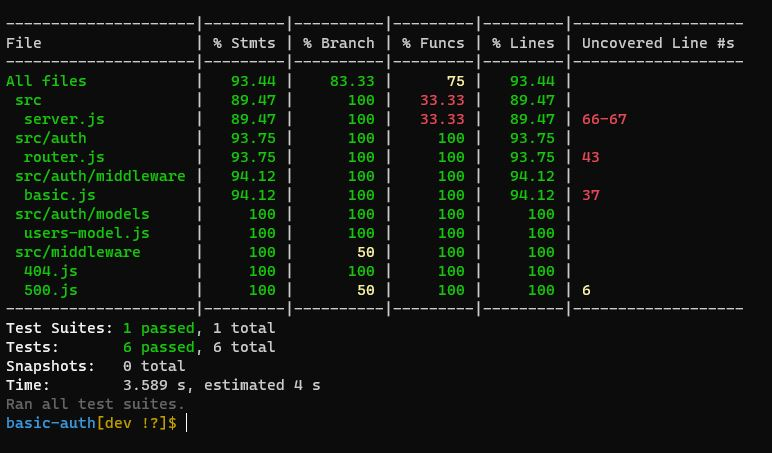
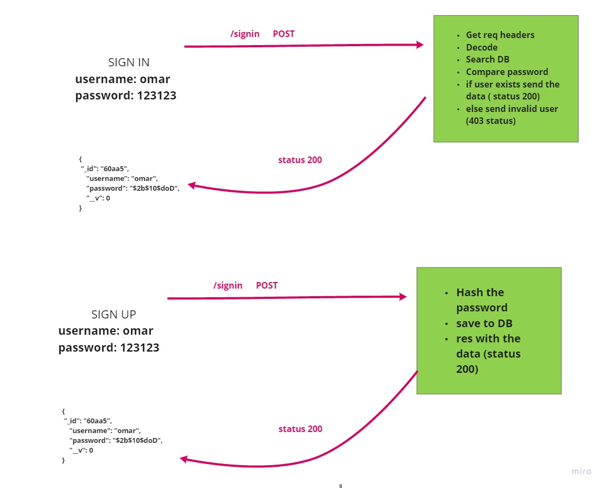

# basic-auth

## Author: Omar Ewies
* [Tests Report](https://github.com/oebitw/basic-auth/actions)

* [Heroku Deployment](https://oebitw-basic-auth.herokuapp.com/)

* [Pull Request](https://github.com/oebitw/basic-auth/pull/1)

## Setup

1) Clone the repo
2) npm init -y.
3) npm install.
4) Create .env file with PORT=3030.

## Test
* npm test

## Run the app
* npm start

## End points

### `api/v1/signup`: POST Method

[https://oebitw-basic-auth.herokuapp.com/api/v1/signup](https://oebitw-basic-auth.herokuapp.com/api/v1/signup)

* You can Sign-up by sending post request using postman.

Example of the data when you sign up :

`
{
    "_id": "60aa89c218a5330015efaecf",
    "username": "ewies",
    "password": "$2b$10$e3nI5.Ob9yYzevra08Z5IONMrKKBONwqByouf6d3F4kzFpn5FTemi",
    "__v": 0
}
`

### `api/v1/signin`:  POST Method

[https://oebitw-basic-auth.herokuapp.com/api/v1/signin](https://oebitw-basic-auth.herokuapp.com/api/v1/signin)

* You can signin by sending post request using postman.

Example of the data when you sign in :

`
{
    "_id": "60aa89c218a5330015efaecf",
    "username": "ewies",
    "password": "$2b$10$e3nI5.Ob9yYzevra08Z5IONMrKKBONwqByouf6d3F4kzFpn5FTemi",
    "__v": 0
}
`

## UML

